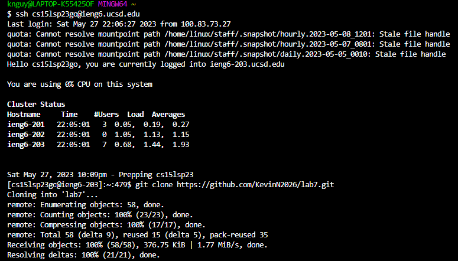

For step 4, which was to log into my ieng6 account, the buttons I pressed were ```<up> <enter>``` because my ssh login command was 1 up in the history. For step 5, which was to clone my fork of the lab 7 repository, I typed "git clone https://github.com/KevinN2026/lab7.git" and I pressed ```<enter>```. For step 6, which was run the tests, I typed "cd lab7" and pressed ```<enter>```. Then I typed "bash test.sh". For step 7, which was to edit the code to fix the failed test, I typed "vim ListExamples.java" and pressed ```<enter>```. Then I pressed / then I typed "index1", then pressed ```<enter>```, and finally, I pressed ```<n><n><n><n><n><n><n><n><n><n>```. Then I pressed ```<e><x><i><2><esc><:>```, then I typed wq. For step 8, which was to run the test to show that the tests pass, I typed "bash test.sh". For step 9, which was to commit and push the changes to my Github account, 
