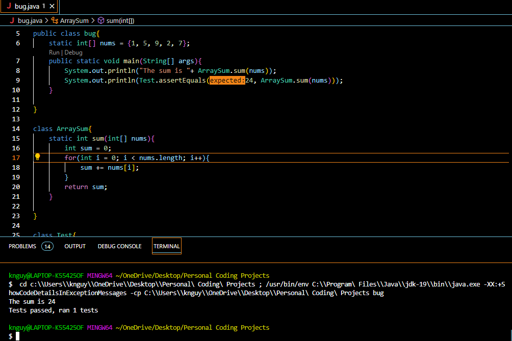

# Part 1
 CSE 15L – Ed Discussion - Google Chrome 6_4_2023 12_23_21 PM.png)
 CSE 15L – Ed Discussion - Google Chrome 6_4_2023 12_23_35 PM.png)
 CSE 15L – Ed Discussion - Google Chrome 6_4_2023 12_23_47 PM.png)
Indeed there is a bug in your program. As you have pointed out, your code is compiling and running with no error. After close examination, I have identified the bug. The bug is in your for loop, your indexing starts at 1. You should start indexing at 0. In your for loop, make the following changes:
```
//Previous code
for(int i =1; i < nums.length; i++)

//Changed int i = 1 to int i = 0
for(int i =0; i < nums.length; i++)
```
Go ahead and try it and see if that works. 



The student made the changes suggested and the bug is now fixed and the output matches the expected output. As previously mentioned, the bug was in the for loop, which was the indexing starting at 1 instead of starting at 0. 

Setup:
The file needed is bug.java, this contains all of the code. The directory will depend the user as the directory in this case was local on my laptop. In general, the directory would be whatever bug.java is located in. 
Here is the contents of the file before fixing the bug:
```
// import static org.junit.Assert.*;
// import org.junit.*;


public class bug{
    static int[] nums = {1, 5, 9, 2, 7};
    public static void main(String[] args){
        System.out.println("The sum is "+ ArraySum.sum(nums));
        System.out.println(Test.assertEquals(24, ArraySum.sum(nums)));   
    }

}

class ArraySum{
    static int sum(int[] nums){
        int sum = 0;
        for(int i = 0; i < nums.length; i++){
            sum += nums[i];
        }
        return sum;
    }

}

class Test{
    public static String assertEquals(int expected, int actual){
        if(expected == actual){
            return "Tests passed, ran 1 tests";
        }
        return "Failure!!!!!!!!! Expected was " + expected + ", but actual was " + actual;
    }

}

```

The command is also dependent on the user since the command used to run the file in this case was based on where bug.java was located on my laptop. On top of the main method, there should be a run/debug button. Clicking the run button will automatically autofill the command containing the file path and run the file. To fix the bug, change the ```int i = 0``` statement in the for ```loop to int i = 1```. 

***
# Part 2
To be honest, I did not learn much in this quarter. In terms of Java, nothing new. But, I did learn a little bit about working on scripts and practicing debugging. Both came from labs, which did focus on debugging and writing scripts. There were multiple labs where we focused on writing a grading script using bash. 
