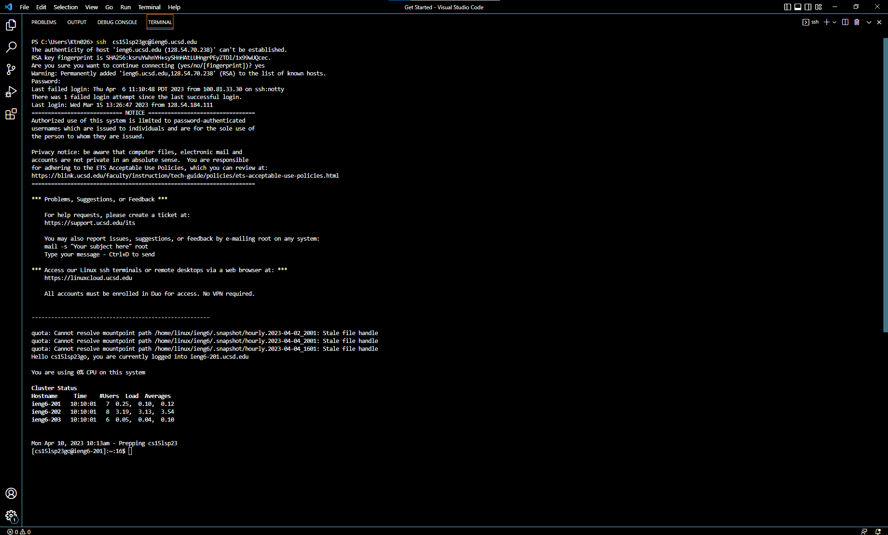
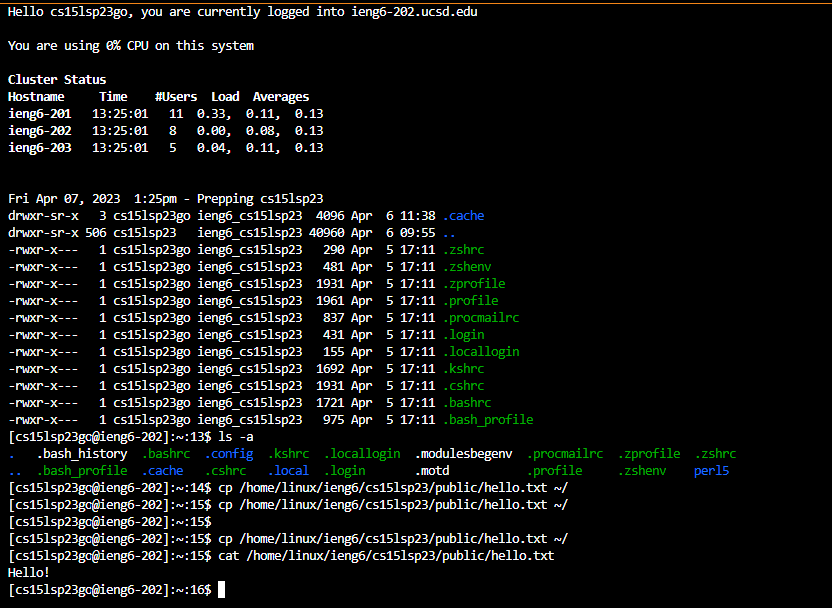

# **Visual Studio Code**

If you don't have Visual Studio Code installed on your computer already, you have to download and install it onto your computer [here](https://code.visualstudio.com/). When you're on the website, hit the download button. After your download is completeted, open it and install it. When you have installed VSC and opened it, you should see this: 

# **Remotely Connecting**

You will need to have [git](https://gitforwindows.org/) installed. After installing git, go to the terminal in Visual Studio Code. You will need the terminal to be using [git bash](https://stackoverflow.com/a/50527994). After that, you will need to type ssh cs15lsp23zz@ieng6.ucsd.edu into the terminal. **Note: zz is a placeholder, you will replace zz with the corresponding letters of your [account](https://sdacs.ucsd.edu/~icc/index.php).** It will look different for everyone. After entering that into the terminal, it will display the message: 

"The authenticity of host 'ieng6.ucsd.edu (128.54.70.238)' can't be established.
RSA key fingerprint is SHA256:ksruYwhnYH+sySHnHAtLUHngrPEyZTDl/1x99wUQcec.     
Are you sure you want to continue connecting (yes/no/[fingerprint])?".

Type yes. Then it will display a message that looks like this "Warning: Permanently added 'ieng6.ucsd.edu,128.54.70.238' (RSA) to the list of known hosts.". Immediately after that message, it will ask you for your password. Enter your password to your cs15lsp23zz account. **Note: When entering your password, the terminal will not display anything while you're typing. Even though it's not displaying anything, the characters are still typed. Just be careful not to make mistakes as again, nothing is displayed.**

You are successfully logged in if you see a message looking like this:

.png)

The entire terminal after a successful login should look something like this:

Note: The text may be hard to see, you may have to open this image in a new tab to see it better.

# **Trying Some Commands**

Now that you have successfully remote connected to a computer, let's try some commands. Experiment and play around with different commands to see what they do. Type the commands into the terminal in Visual Studio Code. To get to the terminal in VSC:
1. Click on **terminal** at the top.
2. Then click on **new terminal**.

Here is a list of some commands:
* cd ~
* cd
* ls -lat
* ls -a
* ls /home/linux/ieng6/cs15lsp23/cs15lsp23abc **Note: abc is another person's username** 
* cp /home/linux/ieng6/cs15lsp23/public/hello.txt ~/
* cat /home/linux/ieng6/cs15lsp23/public/hello.txt

Here's an example of what the terminal might look like after trying all of the commands:

