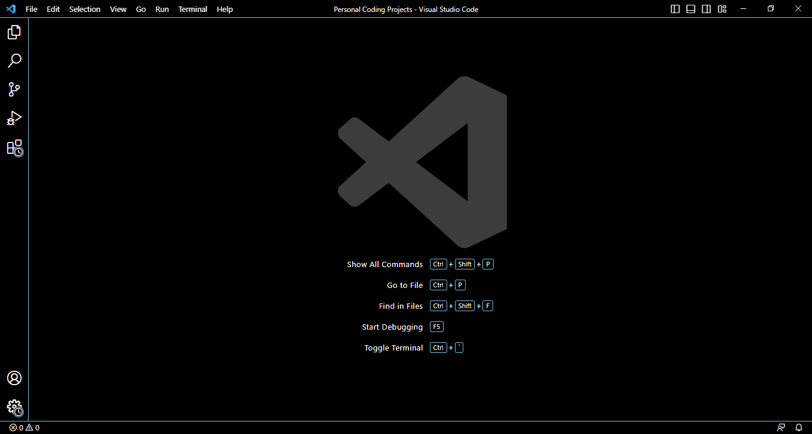

# **Visual Studio Code**

If you don't have Visual Studio Code installed on your computer already, you have to download and install it onto your computer [here](https://code.visualstudio.com/). When you're on the website, hit the download button. After your download is completeted, open it and install it. When you have installed VSC and opened it, you should see this: 

# **Remotely Connecting**

# **Trying Some Commands**

Now that you have successfully remote connected to a computer, let's try some commands. Experiment and play around with different commands to see what they do. Type the commands into the terminal in Visual Studio Code. To get to the terminal in VSC:
1. Click on **terminal** at the top.
2. Then click on **new terminal**.

Here is a list of some commands:
* cd ~
* cd
* ls -lat
* ls -a
* ls /home/linux/ieng6/cs15lsp23/cs15lsp23abc **Note: abc is another person's username** 
* cp /home/linux/ieng6/cs15lsp23/public/hello.txt ~/
* cat /home/linux/ieng6/cs15lsp23/public/hello.txt
