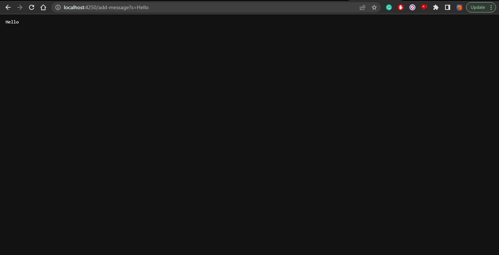
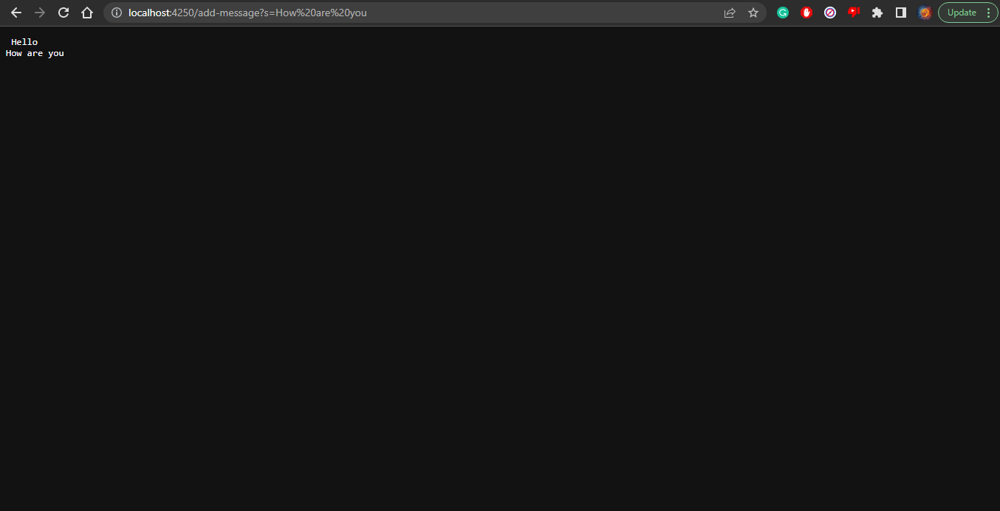

# **Part 1**

```
import java.io.IOException;
import java.net.URI;

class StringHandler implements URLHandler {
    String string = "";

    public String handleRequest(URI url) {
        if (url.getPath().equals("/")) {
            return String.format("Kevin's message %s", string);
        } 
        else {
            System.out.println("Path: " + url.getPath());
            if (url.getPath().contains("/add-message")) {
                String[] parameters = url.getQuery().split("=");
                string += parameters[1] + "\n";
                return string;
            }
            return "404 Not Found!";
        }
    }
}

class StringServer {
    public static void main(String[] args) throws IOException {
        if(args.length == 0){
            System.out.println("Missing port number! Try any number between 1024 to 49151");
            return;
        }

        int port = Integer.parseInt(args[0]);

        Server.start(port, new StringHandler());
    }
}

```


The handleRequest method is being called. The argument for this method is the URL, in this case would be http://localhost:4250/add-message?s=Hello. Since /add-message?s=Hello was entered into the search bar, the first if statement was not satisfied and moved onto the else statement. It satisfies the else statement and changes the previous value, which was an empty string, of string to be Hello. 



The handleRequest method is being called. The argument for this method is the URL, in this case would be http://localhost:4250/add-message?s=How%20are%20you. Since /add-message?s=How are you was entered into the search bar, the first if statement was not satisfied and moved onto the else statement. It satisfies the else statement and changes the previous value, which was Hello, of string to be Hello How are you. After Hello is a new line character. 

# **Part 2**
Failure inducing inputs for both reverse methods was any array that was not empty and had more than one elements. An example of failure inducing inputs are
```
@Test
  public void testReversed2Elem(){
    int[] input1 = {1, 2};
    assertArrayEquals(new int[]{2, 1}, ArrayExamples.reversed(input1));
  }
@Test 
   public void testReverseInPlace4Elem() {
     int[] input1 = {9, 6, 3, 0};
     ArrayExamples.reverseInPlace(input1);
     assertArrayEquals(new int[]{0, 3, 6, 9}, input1);
}
```

Non failure inducing inputs for both reverse methods are 
```
@Test
  public void testReversed() {
    int[] input1 = { };
    assertArrayEquals(new int[]{ }, ArrayExamples.reversed(input1));
  }
  
 @Test 
    public void testReverseInPlaceEmpty() {
      int[] input1 = {};
      ArrayExamples.reverseInPlace(input1);
      assertArrayEquals(new int[]{}, input1);
}
```

Code before change:
```
public class ArrayExamples {
  static void reverseInPlace(int[] arr) {
    for(int i = 0; i < arr.length; i += 1) {
      arr[i] = arr[arr.length - i - 1];
    }
  }

  static int[] reversed(int[] arr) {
    int[] newArray = new int[arr.length];
    for(int i = 0; i < arr.length; i += 1) {
      arr[i] = newArray[arr.length - i - 1];
    }
    return arr;
  }
```

Code after change:
```
public class ArrayExamples {

  // Changes the input array to be in reversed order
  static void reverseInPlace(int[] arr) {
    for(int i = 0; i < arr.length/2; i += 1) {
      int temp = arr[i];
      arr[i] = arr[(arr.length - 1) - i];
      arr[(arr.length - 1) - i] = temp;
    }
  }

  // Returns a *new* array with all the elements of the input array in reversed
  // order
  static int[] reversed(int[] arr) {
    int[] newArray = new int[arr.length];
    for(int i = 0; i < arr.length; i += 1) {
      arr[i] = newArray[arr.length - i - 1];
    }
    return arr;
  }
```
